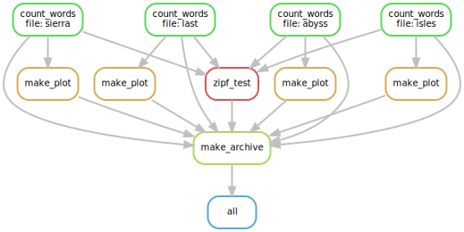

Now that we know how to write and scale a pipeline, 
here are some tips and tricks for making the process go more smoothly.

## `snakemake -n` is your friend

Whenever you edit your Snakefile, run `snakemake -n` immediately afterwards.
This will check for errors and make sure that the pipeline is able to run.

The most common source of errors is a mismatch in filenames
(Snakemake doesn't know how to produce a particular output file) -
`snakemake -n` will catch this as long as the troublesome output files haven't already been made.

## Configuring logging

By default, Snakemake prints all output from stderr and stdout from rules.
This is useful, but if a failure occurs (or we otherwise need to inspect the logs)
it can be extremely difficult to determine what happened
or which rule had an issue, 
especially when running in parallel.

The solution to this issue is to redirect the output from each rule/
set of inputs to a dedicated logfile.
We can do this using the `log` keyword.
Let's modify our `count_words` rule to be slighly more verbose and redirect
this output to a dedicated logfile.

Two things before we start:

* `&>` is a handy operator in bash that redirects both stdout and stderr to a file.
* `&>>` does the same thing as `&>`, but appends to a file instead of overwriting it.

```python
# count words in one of our "books"
rule count_words:
    input: 	
        wc='wordcount.py',
        book='books/{file}.txt'
    output: 'dats/{file}.dat'
    threads: 4
    log: 'dats/{file}.log'
    shell:
        '''
        echo "Running {input.wc} with {threads} cores on {input.book}." &> {log}
        python {input.wc} {input.book} {output} &>> {log}
        '''
```


```bash
snakemake clean
snakemake -j 8
cat dats/abyss.log
```

```
# snakemake output omitted
Running wordcount.py with 4 cores on books/abyss.txt.
```
{: .output}

Notice how the pipeline no longer prints to the pipeline's log, 
and instead redirects this to a logfile.

> ## Choosing a good logfile location
> 
> Though you can put a log anywhere (and name it anything),
> it is often a good practice to put the log in the same directory
> where the rule's output will be created.
> If you need to investigate the output for a rule and associated logfiles,
> this means that you only have to check one location!
{: .callout}

## Token files

Often, a rule does not generate a unique output, and merely modifies a file.
In these cases it is often worthwhile to create a placeholder, or "token file" as output.
A token file is simply an empty file that you can create with the touch command 
(`touch some_file.txt` creates an empty file called `some_file.txt`).
An example rule using this technique is shown below:

```python
rule token_example:
    input:  'some_file.txt'
    output: 'some_file.tkn'   # marks some_file.txt as modified
    shell:
        '''
        some_command --do-things {input} &&
            touch {output}
        '''
```


## Directory locks

Only one instance of Snakemake can run in a directory at a time.
If a Snakemake run fails without unlocking the directory 
(if you killed the process, for instance), you can run
`snakemake --unlock` to unlock it.

## Python as a fallback

Remember, you can use Python imports and functions anywhere in a Snakefile.
If something seems a little tricky to implement - Python can do it.
The `os`, `shutil`, and `subprocess` packages are useful tools for using Python
to execute command line actions.
In particular, `os.system('some command')` will run a command on the command-line
and block until execution is complete.

## Creating a workflow diagram

Assuming graphviz is installed (`conda install graphviz`),
you can create a diagram of your workflow with the command:
`snakemake --dag | dot -Tsvg > dag.svg`.
This creates a plot of your "directed acyclic graph" 
(a plot of all of the rules Snakemake thinks it needs to complete),
which you can view using any picture viewing program.
In fact this was the tool used to create all of the diagrams in this lesson:

```bash
snakemake --dag | dot -Tsvg > dag.svg
eog dag.svg     # eog is an image viewer installed on many linux systems
```



Rules that have yet to be completed are indicated with solid outlines.
Already completed tasks will be indicated with dashed outlines.
In this case, I ran `snakemake clean`, just before creating the diagram - 
no rules have been run yet.

## Viewing the GUI

Snakemake has an experimental web browser GUI.
I personally haven't used it for anything, 
but it's cool to know it's there and can be used to view your workflow on the fly.

`snakemake --gui`

## Where to go for documentation / help

The Snakemake documentation is located at 
[snakemake.readthedocs.io](http://snakemake.readthedocs.io)
